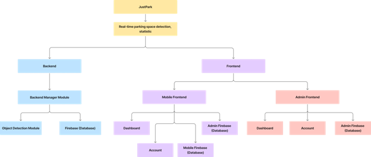

# Project Design & Overview

## Section 1 - Project Background

### 1.1 Project Name

"JustPark"

### 1.2 Project Scope

•	A Real-time car parking slot detection web application for property and public users

### 1.3 Team

    Tsz Chun Chow, Samuel (Team Leader)

    - Backend
        •   Tsz Chun Chow, Samuel
        •   Frack Wang
        •	Phucthien Bao Nguyen, Peter

    - Frontend
        •   Alexander Regis, Alex
        •   Diya Sharma, Diya

### 1.4 Motivation & Idea

- Finding public parking space constantly is a challenge for drivers. People often need to drive to the parking area before realizing whether there is any vacant space available. This inconvenience inspires the idea of a web application that provides real-time parking space detection and statistical services.

## Section 2 - Project Overview

Project Description

- The project is web application development with two frontends and one backend. The two frontends serve for public users and parking site property owners, while the backend handles the request from the two fronts on providing real-time site video streaming, at the same time incorporated with parking slot vacancy and occupied detection. Statistics on these two counts will be displayed in the application user interface for further management purposes.

- Mobile users would be able to use the application on checking different parking site locations parking conditions with information provided by the parking property party.

- The admin property management users allow to share its information or notice to the public users.

 

Target Audience

•	Public users, Car Parking Commercial

## Section 3 - System Overview

 

