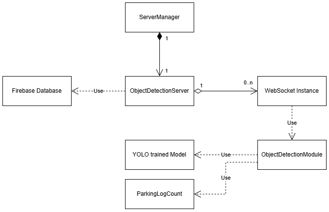
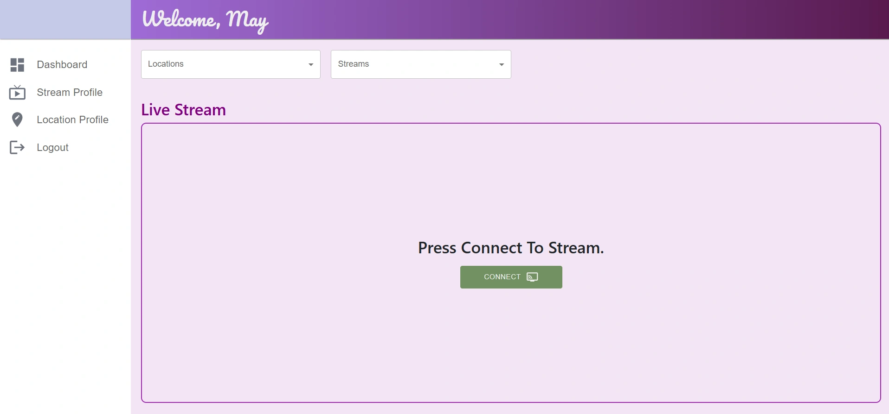

# Project Design & Overview

## Section 1 - Project Background

### 1.1 Project Name

"JustPark"

### 1.2 Project Scope

•	A Real-time car parking slot detection web application for property and public users

### 1.3 Team

### 1.4 Motivation & Idea

- Finding public parking space constantly is a challenge for drivers. People often need to drive to the parking area before realizing whether there is any vacant space available. This inconvenience inspires the idea of a web application that provides real-time parking space detection and statistical services.

 

## Section 2 - Project Overview

### 2.1 Project Description

- The project is web application development with two frontends and one backend. The two frontends serve for public users and parking site property owners, while the backend handles the request from the two fronts on providing real-time site video streaming, at the same time incorporated with parking slot vacancy and occupied detection. Statistics on these two counts will be displayed in the application user interface for further management purposes.

- Mobile users would be able to use the application on checking different parking site locations parking conditions with information provided by the parking property party.

- The admin property management users allow to share its information or notice to the public users.

### 2.2 Target Audience

•	Public users, Car Parking Commercial

### 2.2 System Overview

 

 

## Section 3 - Features Overview

|Scope|Features|
|-|-|
|Authentication| Signup & Login (Both mobile and admin frontend support user creation and login)|
|Location & Stream Selection| • Users can search for a specific location to check parking availability • Users can select the stream within each location to retrieve the information and streaming|
|Live Streaming| • Stream Connect: Project would use videos to pretend live streaming resources api that provided by parking site party, and both frontends should be able to connect to selected parking site location  •	Stream Management: Admin frontend for the parking property party can add or remove the parking site resources for updating or blocking the stream access|
|Object Detection|•	Parking slot identification: Parking slot of vacant or occupied condition should be able to detect and be identified •	Metrics: Counting of vacant or occupied condition should be able to provide to frontend interface •	Enable disable Detection: Feature provide for user to turn on off the detection during streaming|
|Admin Management|•	Parking property frontend allows users to create, modify, and delete the stream resources •	Parking property frontend allows users to create their parking site location •	Parking property frontend allows users to add their shared information with a friendly entry system through entering keys and its information value. That information would be displayed to the public frontend|

 

## Section 4 - Languages, Libraries, Frameworks & Database

|| Frontend (mobile) | Frontend (Admin Management) | Backend|
|-|-|-|-|
|Language|Javascript|Javascript|Python|
|Framework|NodeJS, React| NodeJS, React-Vite| Python|
|Library / Package| Bootstrap, Firestore| Bootstrap, MUL, Firestore| YOLO (Ultralytics), OpenCV, FastAPI, PyJWT, Firestore|
|Database| Firebase| Firebase| N/A|

 

## Section 5 - Tools Utilization

|Tools|Description|
|-|-|
|Trello Workspace| Work distribution and scheduling|
|Figma|Graph whiteboard, brainstorming|
|One Drive| File sharing and storage|
|DrawIO| Technical drawing|
|Roboflow| Image dataset storage, class annotation|
|Google Colab| Data training|
|VSCode| IDE |

 

## Section 6 - Use Case

## Section 7 - Dataset

### 7.1 Data preparation workflow

### 7.2 Roboflow image project & annotation

### 7.3 Google Colab Data training

 

## Section 8 - Class Diagram

### 8.1 Frontend - User

### 8.2 Frontend - Admin

### 8.3 Backend - Object Detection

### 8.4 WebSocket Transition

 

## Section 9 - Database Diagram

### 9.1 Frontend - User

### 9.2 Frontend - Admin

 

## Section 10 - UI

### 10.1 Frontend - Admin

## END of Document
